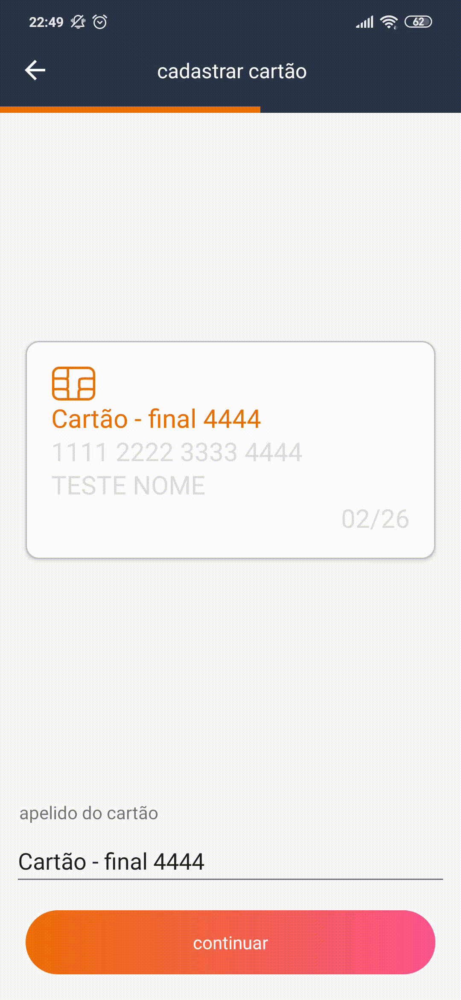
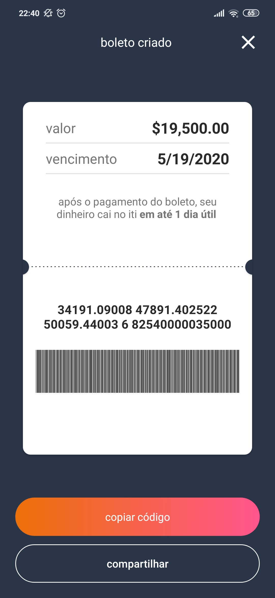

# Xamarin.Forms Iti Clone

Clone do aplicativo Iti desenvolvido em Xamarin.Forms

## Gifs
<kbd></kbd>
<kbd></kbd>

## Screenshots

### Android

#### Tela inicial
<kbd></kbd>
<kbd></kbd>
<kbd></kbd>
<kbd></kbd>
<kbd></kbd>
<kbd></kbd>
<kbd></kbd>

#### Tela para depositar dinheiro
<kbd></kbd>
<kbd></kbd>
<kbd></kbd>

#### Tela para cobrar alguém
<kbd></kbd>
<kbd></kbd>
<kbd></kbd>

#### Tela para cadastrar um cartão
<kbd></kbd>
<kbd></kbd>
<kbd></kbd>
<kbd></kbd>
<kbd></kbd>
<kbd></kbd>
<kbd></kbd>

### iOS

#### Tela inicial

#### Tela para depositar dinheiro

#### Tela para cobrar alguém

#### Tela para cadastrar um cartão
